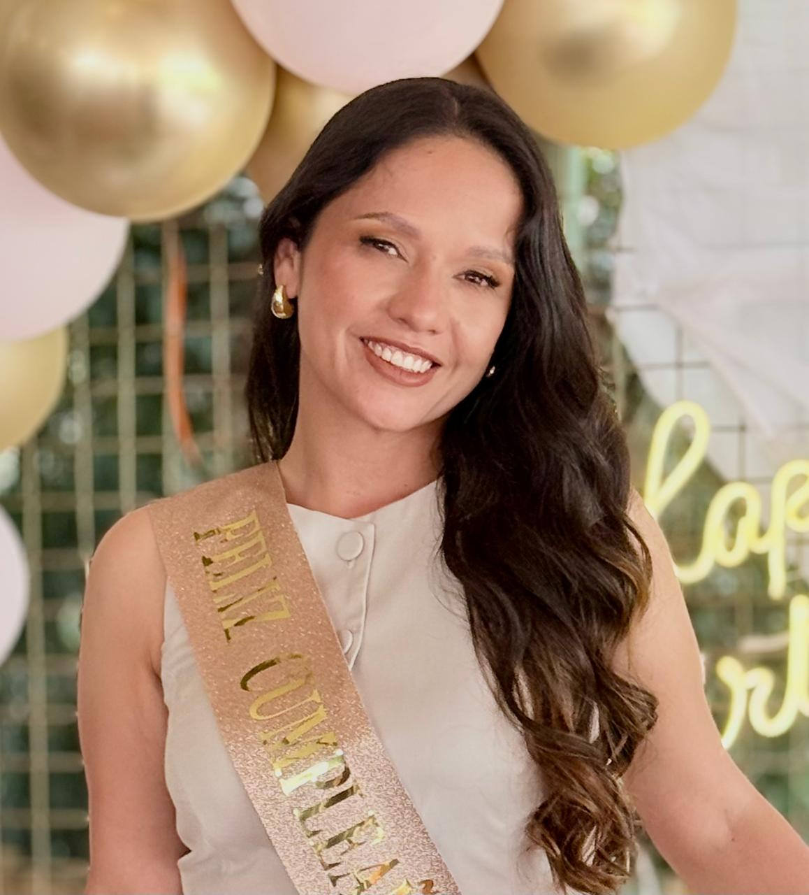

# 01-canguros-golpeadores

## Curso Programación para Videojuegos

# Presentación Personal

## Foto Personal

---

## Nombre

**Liliana Marcela Daza**
**Estudiante de Ingenieria multimedia**

---

## Rol en la Industria

**Diseñadora Multimedia para Videojuegos**

---

## Ubicación

Tunja, Boyacá - Colombia

---

## Perfil Breve

Soy estudiante de Ingeniería Multimedia me gustaria aprender sobre el desarrollo de videojuegos, y especializarme en 
animación digital y producción de contenido interactivo.
Me gusta crear experiencias digitales innovadoras que integren creatividad,
tecnología y entretenimiento.

---

## Mi Plato Favorito

**Pasta con camarones**

dsds